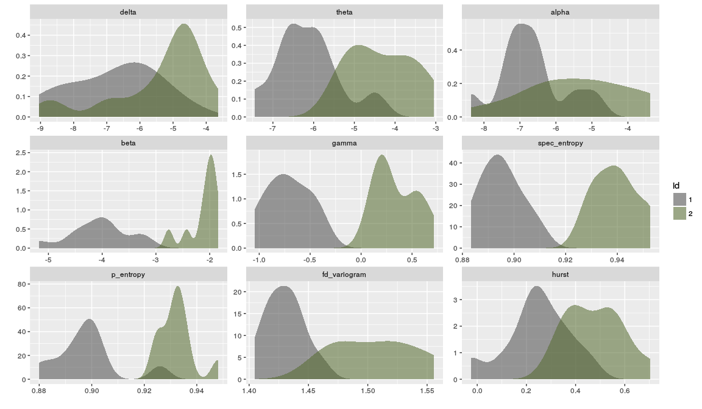

<!-- README.md is generated from README.Rmd. Please edit that file -->
tsfeats
=======

Provides wrappers and sets the parameters for few time series features.

Example
=======

A call to one of the feature functions returns the complete output of the original feature as an S3 class. The `clean_feature` function returns a dataframe with one or more features taken from the initial output.

``` r
library(tsfeats) 
res <- fd_variogram(rnorm(1000))
clean_feature(res)
#>   fd_variogram
#> 1     1.971022
```

In the next example we generate two groups of functions from an ARMA model with varying parameters. The `get_features` function can be used to compute and clean multiple features and returns a single dataframe.

``` r
# Generate 10 samples from 2 ARMA models
t1 <- replicate(10, arima.sim(n = 500, list(ar = c(0.78, -0.5), ma = c(-5, 0,5))))
t2 <- replicate(10, arima.sim(n = 500, list(ar = c(0.91, -0.2), ma = c(-5, 0,5))))

# The features to compute
features <- c(bandpower, spectral_entropy, 
              permutation_entropy, fd_variogram, hurst)

# Compute features on each group
df1 <- get_features(t1, features, id = "1")
df2 <- get_features(t2, features, id = "2")

# Bandpower defaults to typical EEG frequency bands  
df1[1, 1:5]
#>        delta     theta     alpha      beta      gamma
#> V1 -9.047831 -5.429252 -7.333314 -3.249996 -0.5063806
```

A plot comparing the distribution of each feature for the two groups.

``` r
library(ggplot2)
library(reshape2)
# Plot feature densities for each group
data_long <- reshape2::melt(rbind(df1, df2), id.vars = c("id"))

gg <- ggplot(data_long, aes(x=value, fill=id)) +
             geom_density(alpha = 0.55, 
                      aes(y = ..density..), 
                      color = NA, 
                      position = "identity")
gg + facet_wrap(~variable, ncol = 3, scales = "free") + 
        labs(x = "", y = "") + 
        scale_fill_manual(values = c("gray30","darkolivegreen"))
```



Installation
============

``` r
install.packages("devtools") 
devtools::install_github("nwaff/tsfeats")
```
